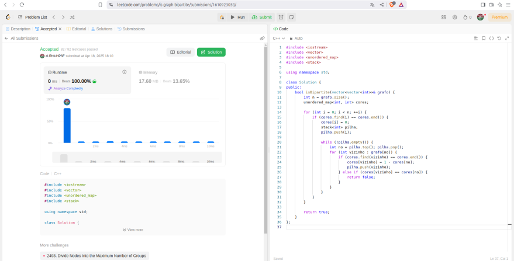
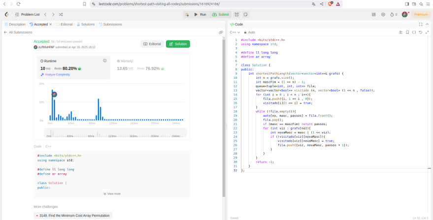
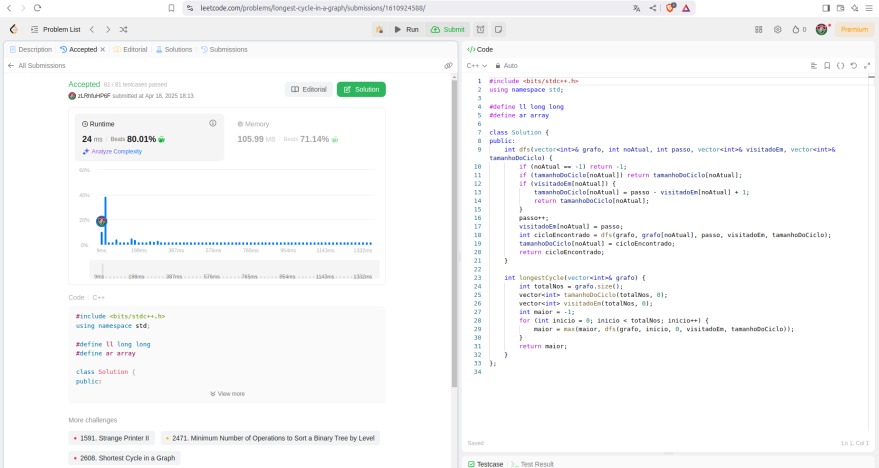
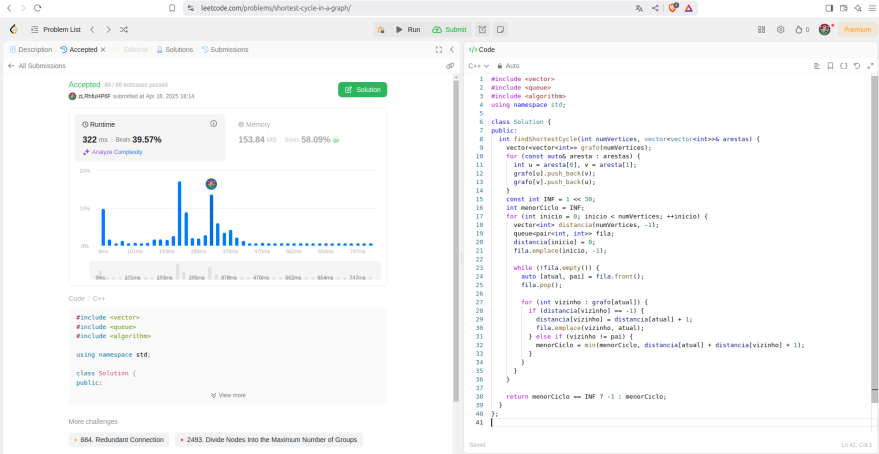

# Exercícios LeetCode

**Número da Lista**: 1
**Conteúdo da Disciplina**: Grafos 1
 
## Alunos
|Matrícula | Aluno |GitHub|
| -- | -- | -- |
| 23/1035428  | Leonardo Henrique Sobral Sauma Junior |[leohssjr](https://github.com/leohssjr)|
| 23/1011426  | Gustavo Gontijo Lima |[Guga301104](https://github.com/guga301104)|

## Sobre 
Este repositório tem como objetivo a resolução de exercícios sobre grafos do [LeetCode](https://leetcode.com/), utilizando o conteúdo de Grafos 1 da disciplina Projeto de Algoritmos, sendo 1 de nível médio e 3 de nível difícil.

|Exercício | Dificuldade |
| -- | -- |
|[785. Is Graph Bipartite?](https://leetcode.com/problems/is-graph-bipartite/)|🟡 Médio|
|[847. Shortest Path Visiting All Nodes](https://leetcode.com/problems/shortest-path-visiting-all-nodes)|🔴 Difícil|
|[2608. Shortest Cycle in a Graph](https://leetcode.com/problems/shortest-cycle-in-a-graph/)|🔴 Difícil|
|[2360. Longest Cycle in a Graph](https://leetcode.com/problems/longest-cycle-in-a-graph/)|🔴 Difícil|

## Screenshots

### Exercício 1 - [785. Is Graph Bipartite?](https://leetcode.com/problems/is-graph-bipartite)


Dificuldade: 🟡 Média
Problema: [Is Graph Bipartite?](https://leetcode.com/problems/is-graph-bipartite/)
Codigo: [Solução](https://github.com/projeto-de-algoritmos-2025/Grafos1LeetCode/blob/main/questoes/leetCode_785.cpp)

### Exercício 2 - [847. Shortest Path Visiting All Nodes](https://leetcode.com/problems/shortest-path-visiting-all-nodes)


Dificuldade: 🔴 Difícil
Problema: [Shortest Path Visiting All Nodes](https://leetcode.com/problems/shortest-path-visiting-all-nodes)
[Resposta](https://github.com/projeto-de-algoritmos-2025/Grafos1LeetCode/blob/main/questoes/leetCode_847.cpp)

### Exerício 3 - [2360. Longest Cycle in a Graph](https://leetcode.com/problems/longest-cycle-in-a-graph/)


Dificuldade: 🔴 Difícil
Problema: [2360. Longest Cycle in a Graph](https://leetcode.com/problems/longest-cycle-in-a-graph/)
[Resposta](https://github.com/projeto-de-algoritmos-2025/Grafos1LeetCode/blob/main/questoes/leetCode_2360.cpp)

### Exercício 4 - [2608. Shortest Cycle in a Graph](https://leetcode.com/problems/shortest-cycle-in-a-graph/)


Dificuldade: 🔴 Difícil
Problema: [Shortest Cycle in a Graph](https://leetcode.com/problems/shortest-cycle-in-a-graph/)
[Resposta](https://github.com/projeto-de-algoritmos-2025/Grafos1LeetCode/blob/main/questoes/leetCode_2608.cpp)

## Instalação 
**Linguagem**: C++
- Para os testes e julgamentos automáticos, os códigos devem ser executados no LeetCode.

## Uso 
Para cada código, deve-se:
- 1: Copiar o codigo do arquivo ```*.cpp``` disponível nesse repositório.
 
- 2: Entrar no site do LeetCode para o problema da questão.

- 5: Alterar a linguagem para ```C++``` caso esteja em outra linguagem.
 
- 6: Colar o código na área destinada para a resposta.
 
- 7: Clicar em ```Run``` para testar os casos básicos.

- 8: Clicar em ```Submit``` para receber o resultado de aprovação do código.
